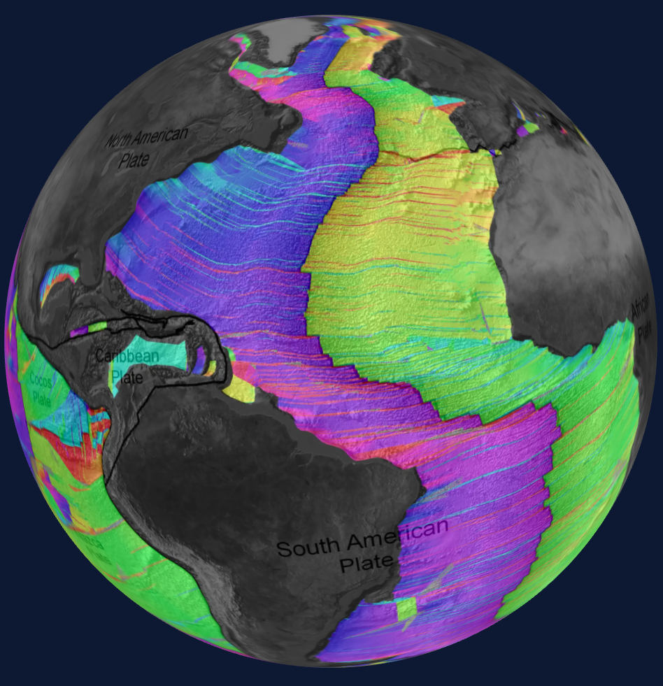
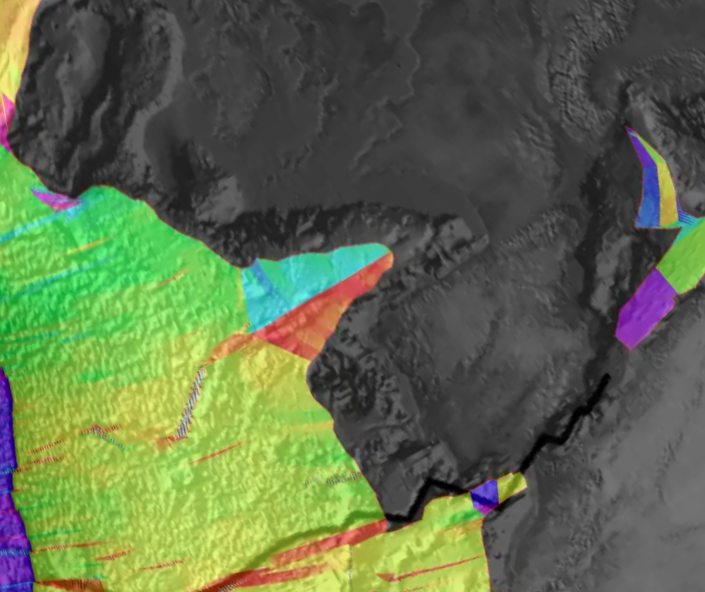

# Small World

An expansion tectonic model of the Earth.

[Live Demo](https://smallworld.betweenconcepts.com): Currently showing age gradients. These are computed from a map of the age of the ocean floor. See [data/](./data) for more information about the source map. The computed colors represent the direction of greatest change in age at any given point on the oceanic crust. Representing the age data as a gradient makes it easier to visualize plate motion over time.



Opposite colours can either indicate:
- a spreading zone where new ocean floor was created
- a transform fault where crust of the same age has slipped apart in opposite directions


Some oceanic rifts are no longer active, but are clearly visible when the sea floor age is mapped in this way. For example, here is an ancient rift between Spain and France.



## Goals

This project is a work-in-progress. The goal of this project is to reconstruct past globes by incrementally removing the youngest oceanic crust, and remapping in a physically realistic way onto a smaller globe. The starting assumption is that there is no subduction, and that the Earth has been growing in mass. If the assumptions are valid, we should be able to fit the continents back together on a smaller globe, with fewer gaps between, than static Earth model reconstructions can produce.

The first step towards this goal was to compute age gradients, showing the direction of greatest change of age at any point in the Earth's oceanic crust. These can be used to guide the movement of the remaining crust following removal at each interval.

## Setup

This project was developed and tested on macOS.

This project uses GIT LFS. Install it. After cloning this repo run

```
git lfs pull
```

## Rebuilding the Age Rate of change

Run:

```
cd model
cargo run --release --bin rebuild_bearings
```

## Converting NetCDF to an Image

Run:

```
cd model
cargo run --release --bin nc_to_image
```

## Using the Viewer

Run:

```
npm start
```

and visit http://localhost:8080/
